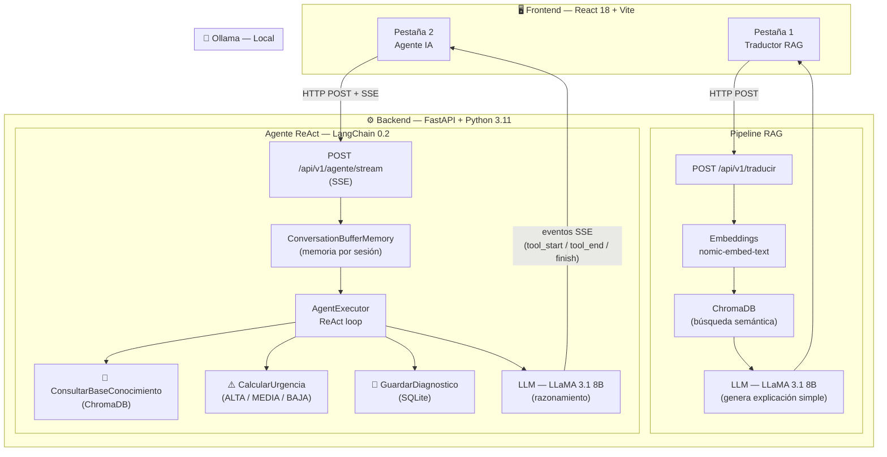

# 🔧 Taller IA — Diagnósticos Mecánicos con IA

**IMPORTANTE, LA ESTRUCTURA DE ARCHIVOS QUEDO RARA AL USAR UNA MAC PARA HACER LA SEGUNDA PARTE, POR LO QUE TODO LO DE LA EVALUACION 2 ESTA DENTRO DE LA CARPETA TALLER-IA2**

Sistema de inteligencia artificial para talleres mecánicos en Chile. Combina dos capacidades principales: un **Traductor RAG** que convierte diagnósticos técnicos en lenguaje simple para el cliente, y un **Agente IA conversacional** con memoria de sesión que puede razonar sobre herramientas, calcular urgencia y guardar diagnósticos.

Todo corre **100% local** gracias a Ollama, sin necesidad de APIs externas ni costos por uso.

---

## ¿Qué problema resuelve?

| Problema | Solución |
|---|---|
| Los clientes no entienden los diagnósticos técnicos | Traducción automática a lenguaje simple usando RAG |
| Desconfianza en las reparaciones | Explicaciones claras basadas en documentación real |
| Mucho tiempo explicando las mismas fallas | Agente conversacional con memoria por sesión |
| Información técnica dispersa | Base vectorial ChromaDB con documentos del taller |

---

## Arquitectura general



> El proxy de Vite redirige `/api/*` → `localhost:8000`, por lo que no hay problemas de CORS en desarrollo. Todo el procesamiento ocurre localmente, sin llamadas a APIs externas.

---

## Stack tecnológico

| Capa | Tecnología | Para qué se usa |
|---|---|---|
| LLM local | Ollama + LLaMA 3.1 8B | Generación de texto, razonamiento del agente |
| Embeddings | nomic-embed-text | Vectorización de documentos para RAG |
| Backend | FastAPI 0.110 + Python 3.11 | API REST y streaming SSE |
| Agente | LangChain 0.2 (ReAct) | Razonamiento paso a paso con herramientas |
| Base vectorial | ChromaDB | Búsqueda semántica de documentos |
| Persistencia | SQLite | Historial de diagnósticos guardados |
| Frontend | React 18 + Vite 5 + Tailwind CSS | Interfaz web con dos pestañas |

---

## Inicio rápido

### Requisitos previos
- Python 3.11+
- Node.js 18+
- [Ollama](https://ollama.com) instalado y corriendo

### 1. Entorno Python

```bash
python -m venv venv
source venv/bin/activate          # macOS/Linux
# venv\Scripts\activate           # Windows
pip install -r requirements.txt
```

### 2. Modelos Ollama

```bash
ollama pull llama3.1:8b
ollama pull nomic-embed-text
```

### 3. Variables de entorno

Crea un archivo `.env` en la raíz del proyecto:

```env
OLLAMA_MODEL=llama3.1:8b
EMBED_MODEL=nomic-embed-text
CHROMA_DB=./data/chroma
SQLITE_DB=./data/database.db
```

### 4. Indexar documentos

Coloca los PDFs o archivos de texto del taller en `data/documentos/` y ejecuta:

```bash
python scripts/index_documents.py
```

Esto genera la base vectorial en `data/chroma/`.

### 5. Levantar el backend

Desde la raíz del proyecto, con el entorno virtual activo:

```bash
uvicorn app.main:app --reload
```

Verificar que esté corriendo:

```text
INFO:     Uvicorn running on [http://127.0.0.1:8000](http://127.0.0.1:8000) (Press CTRL+C to quit)
INFO:     Started reloader process
INFO:     Application startup complete.
```

- API REST: `http://localhost:8000`
- Documentación Swagger: `http://localhost:8000/docs`

### 6. Levantar el frontend

En otra terminal, desde la carpeta `frontend/`:

```bash
cd frontend
npm install       # solo la primera vez
npm run dev
```

- Aplicación web: `http://localhost:5173`
- El proxy Vite redirige automáticamente `/api/*` → `http://localhost:8000`

> **Orden de inicio recomendado**: primero Ollama, luego el backend, luego el frontend.

---

## Funcionalidades

### Pestaña 1 — Traductor RAG
1. El mecánico ingresa un diagnóstico técnico.
2. El sistema busca contexto relevante en ChromaDB.
3. El LLM genera una explicación simple para el cliente, sin jerga técnica.

### Pestaña 2 — Agente IA con Streaming
Chat conversacional en tiempo real. El agente usa el patrón **ReAct** y muestra cada paso:
- **Pensamiento**: el agente decide qué herramienta usar.
- **🔧 Herramienta en ejecución**: nombre y parámetros.
- **✅ Resultado**: lo que devolvió la herramienta.
- **Respuesta final**: explicación para el cliente en lenguaje chileno.

---

## Herramientas del Agente

| Herramienta | Qué hace |
|---|---|
| `ConsultarBaseConocimiento` | Busca en ChromaDB documentación técnica relevante |
| `CalcularUrgencia` | Evalúa si la falla es urgencia ALTA, MEDIA o BAJA |
| `GuardarDiagnostico` | Persiste el diagnóstico en SQLite con fecha y sesión |

---

## Endpoints de la API

La documentación interactiva (Swagger) está disponible en `http://localhost:8000/docs`.

* `POST /api/v1/traducir`: Traduce un diagnóstico técnico a lenguaje simple usando RAG.
* `POST /api/v1/agente`: Envía un mensaje al agente y espera la respuesta completa.
* `POST /api/v1/agente/stream`: Devuelve la respuesta como **Server-Sent Events (SSE)**.
* `DELETE /api/v1/agente/{session_id}`: Elimina el historial de conversación de una sesión.

---

## Estructura del proyecto

```text
app/
  main.py
  routers/
  services/
  prompts/
  models/
frontend/
  src/
  vite.config.js
data/
  documentos/
  chroma/
  database.db
scripts/
  index_documents.py
  test_rag.py
```

---

## 🔍 Evidencia y Validación del Sistema

Para cumplir con los criterios de evaluación de la asignatura, este repositorio incluye material complementario que permite comprender y validar el funcionamiento de la solución y del Agente ReAct:

* **Bocetos de Diseño:** En la carpeta `docs/` se encuentran los bocetos iniciales de la interfaz de usuario (UI) y el diagrama de arquitectura.
* **Evidencia de Pruebas:** En la carpeta `assets/` se adjuntan capturas de pantalla que demuestran:
  1. La indexación exitosa de documentos en ChromaDB.
  2. La ejecución del flujo de Streaming (SSE) mostrando los pasos de razonamiento del Agente y el uso de las herramientas.
  3. El funcionamiento de las pestañas en el Frontend con React.

### Instrucciones para el Evaluador
Para validar las herramientas, la memoria del Agente y la lógica de negocio de manera rápida, puede utilizar la documentación interactiva generada por FastAPI ingresando a `http://localhost:8000/docs`. Desde allí podrá probar los endpoints de traducción, creación de agentes y borrado de memoria directamente desde su navegador.
